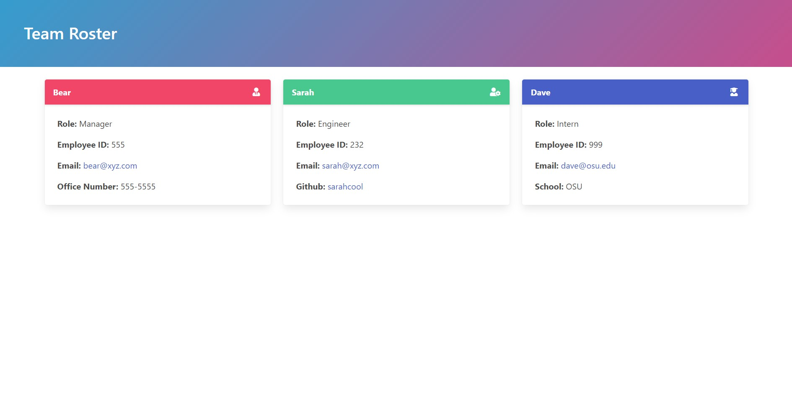

# Team Profile Generator



## Description

This app quickly and easily generates a stylish team roster based on the user's command-line input. It has support for manager, engineer, and intern roles.

## Table of Contents

- [Installation](#installation)
- [Usage](#usage)
- [Credits](#credits)
- [License](#license)

## Installation

The easiest way to install the team roster generator is to clone this repository using the following command.

```
git@github.com:bear-evans/team-profile-generator.git
```

Once downloaded, you can install its dependencies by navigating to the team-profile-generator's directory and issuing the following command.

```
npm install
```

This will install `jest`, `chalk`, and `inquirer`.

## Usage

To initiate the generator, run

```
node index.js
```

from the team-profile-generator directory. For convenience, a [demonstration video](https://drive.google.com/file/d/1GXjEorOOgaSvF7K0uDZLK-0qZ9qQjbNc/view) is also available.

## Tests

This program comes with a testing suite powered by `jest`. You can run the test suite automatically by using

```
npm test
```

after `jest` has been installed.

## Credits

### Chalk - [https://www.npmjs.com/package/chalk](https://www.npmjs.com/package/chalk)

- Chalk is used to colorize the prompts.

### Inquirer - [https://www.npmjs.com/package/inquirer](https://www.npmjs.com/package/inquirer)

- Inquirer is used to generate the user prompts and extract input.

### Alison Quaglia - [https://codepen.io/hylobates-lar/pen/qBbQeON](https://codepen.io/hylobates-lar/pen/qBbQeON)

- This CSS trick is used to give the team roster header a color-changing background.

## License

Copyright 2021 Bear Evans

Permission is hereby granted, free of charge, to any person obtaining a copy of this software and associated documentation files (the "Software"), to deal in the Software without restriction, including without limitation the rights to use, copy, modify, merge, publish, distribute, sublicense, and/or sell copies of the Software, and to permit persons to whom the Software is furnished to do so, subject to the following conditions:

The above copyright notice and this permission notice shall be included in all copies or substantial portions of the Software.

THE SOFTWARE IS PROVIDED "AS IS", WITHOUT WARRANTY OF ANY KIND, EXPRESS OR IMPLIED, INCLUDING BUT NOT LIMITED TO THE WARRANTIES OF MERCHANTABILITY, FITNESS FOR A PARTICULAR PURPOSE AND NONINFRINGEMENT. IN NO EVENT SHALL THE AUTHORS OR COPYRIGHT HOLDERS BE LIABLE FOR ANY CLAIM, DAMAGES OR OTHER LIABILITY, WHETHER IN AN ACTION OF CONTRACT, TORT OR OTHERWISE, ARISING FROM, OUT OF OR IN CONNECTION WITH THE SOFTWARE OR THE USE OR OTHER DEALINGS IN THE SOFTWARE.
